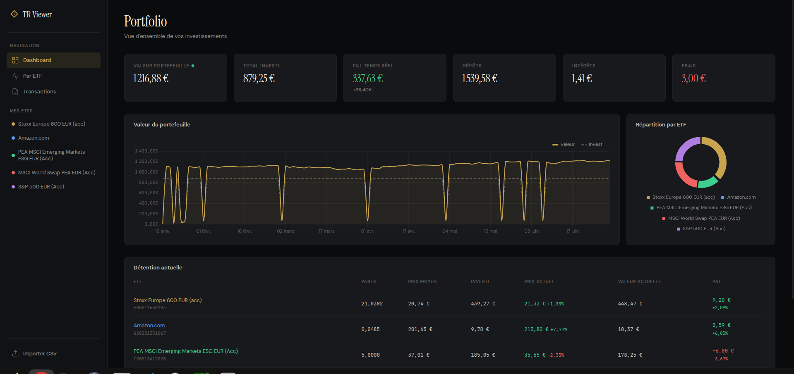

# TR Viewer



Visualisation de relevés de transactions Trade Republic, avec graphiques, suivi par ETF et cours en temps réel.  
Le fichier de transaction peut être téléchargé depuis l'app TR.  

L'app charge automatiquement un fichier `transaction.csv` dans le dossier courrant ou sinon un bouton pour uploader un fichier est dispo dans la UI.  

## Lancer

```bash
python3 server.py
```

Puis ouvrir http://localhost:8080 dans le navigateur.

Le serveur Python est requis : il sert les fichiers statiques et fait proxy vers Yahoo Finance pour récupérer les cours en direct (pas de clé API nécessaire).

## Utilisation

- Le fichier `transaction.csv` est chargé automatiquement au démarrage
- Les cours en direct sont récupérés via Yahoo Finance (un point vert indique les données live)
- L'historique des prix de marché est récupéré pour les graphiques
- Si Yahoo Finance est indisponible, l'app fonctionne normalement avec les prix d'achat en fallback
- Pour importer un autre CSV, utiliser le bouton "Importer CSV" dans la sidebar
- Le CSV doit être au format exporté par Trade Republic

## Vues

### Dashboard
Vue d'ensemble du portfolio : KPIs (valeur, investi, P&L, dépôts, intérêts, frais), graphique de la valeur dans le temps vs montant investi, répartition par ETF, et tableau des positions cliquable.

### Par ETF
Fiche détaillée pour chaque ETF : KPIs, graphique d'évolution du prix et des parts cumulées, historique des transactions. Accessible via la sidebar ou en cliquant sur une ligne du tableau des positions.

### Transactions
Historique complet filtrable par catégorie (Tout / Trading / Cash).

## Données de marché

L'app utilise Yahoo Finance de manière optionnelle et dégradable :

1. **Yahoo dispo** : historique des prix de marché + prix live. Le P&L est calculé sur le prix actuel du marché
2. **Yahoo partiel** : historique disponible mais pas de live. Le dernier prix de marché connu est utilisé
3. **Yahoo down** : l'app fonctionne intégralement avec les prix d'achat du CSV

L'interface s'affiche immédiatement avec les données locales, les données Yahoo arrivent en arrière-plan.

## Stack

- Vanilla HTML/CSS/JS, aucune dépendance build
- Serveur proxy Python (server.py) pour Yahoo Finance
- [Chart.js](https://www.chartjs.org/) pour les graphiques
- [PapaParse](https://www.papaparse.com/) pour le parsing CSV
- Polices : Instrument Serif, DM Sans, JetBrains Mono
